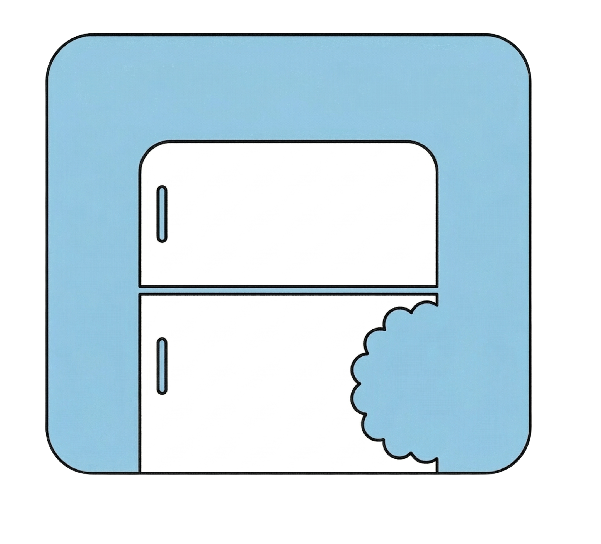
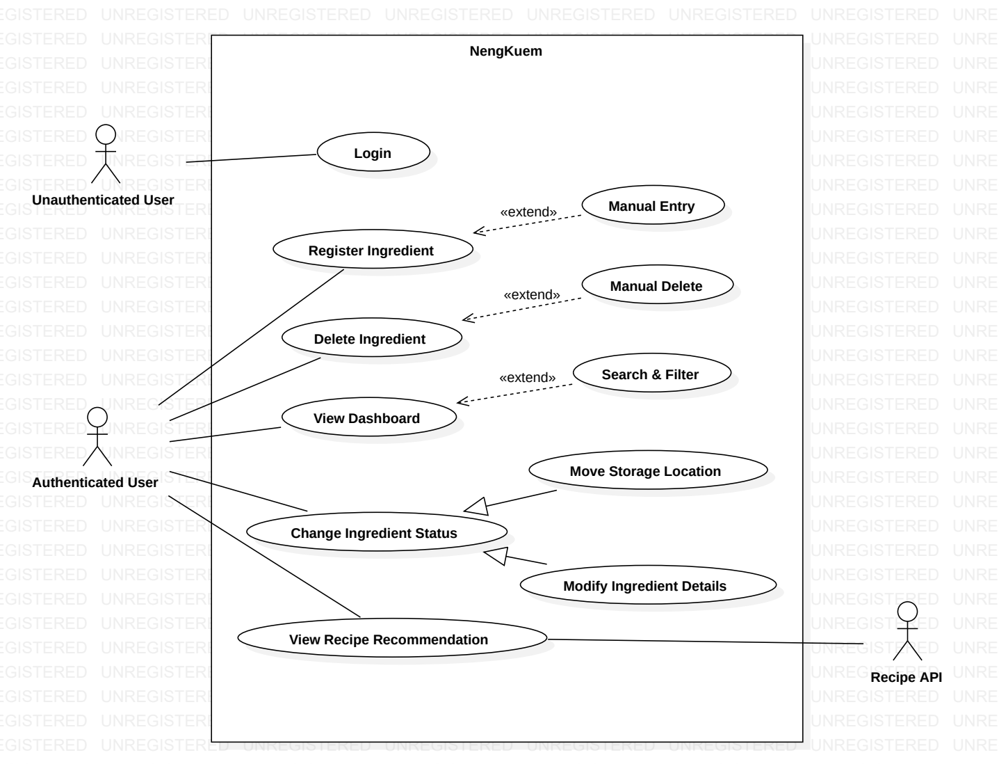
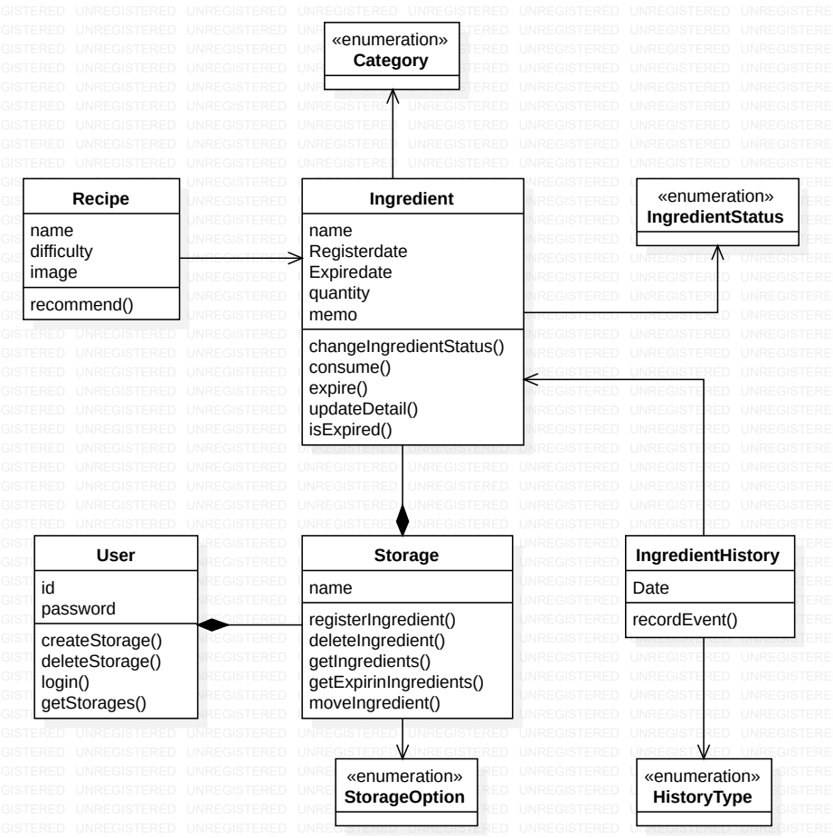

# 2. Analysis

<!-- 프로젝트 이름 -->
<!--로고-->

  <h2 style="margin: 0; border-bottom: none;">
    <strong>냉큼 (Neng_Kuem)</strong>
  </h2>
  

<!--학번, 이름, 이메일-->

 

---

 

  
  | 항목 | 내용 |
  | :--- | :--- |
  | 학번 | 22211499 |
  | 이름 | 정형주 |
  | 이메일 | wjdgudwn03@yu.ac.kr |
  

<!--
Rivision history, 여기 밑엔 표 만들기
[Revision date, version, Description, Author] 항목 만들기
-->

<!--
목차만들기 (Content)
1. Introduction
2.  Use case analysis
3. Domain analysis
4. User Interface prototype
5. Glossary
6. References
-->

 

---

 

  
  | --------------------------------------- 목차 (Content) ------------------------------------------ |
  | :--- |
  | 1. Introduction |
  | 2. Use case analysis |
  | 3. Domain analysis |
  | 4. User Interface prototype |
  | 5. Glossary |
  | 6. References |
     

 

---

 

  
  | Revision date | Version # | Description | Author |
  | :--- | :--- | :--- | :--- |
  | MM/DD/YYYY | 0.00 | Type brief description here | Author name |
  | | | | |
  | | | | |

 

---

 

<!--
1. Introduction
이 문서의 내용을 요약,이 프로젝트의 중요한 특징 묘사
-->

## 1. Introduction

현대 사회에서 대부분의 가정은 냉장고에 다양한 식재료를 보관하고 있으나, 이를 효율적으로 관리하는 데 많은 어려움을 겪고 있습니다. 특히 1인 가구와 맞벌이 가구가 증가하며 집에서 요리하는 횟수가 불규칙해짐에 따라, 냉장고 속 식재료의 존재를 잊거나 유통기한(소비기한)을 넘겨 음식을 폐기하는 문제가 빈번하게 발생하고 있습니다. 이러한 문제는 단순 텍스트 위주 관리 방식으론 직관성이 떨어져 사용자가 관리를 지속하지 못하는 단점을 가지고 있어 문제의 해결책이라 보기 어렵습니다. '냉큼'은 직관적인 냉장고 형태의 UI와 드래그 앤 드롭(Drag & Drop) 기능을 도입하여 사용자의 관리 피로도를 획기적으로 낮추고, 시각적인 변화를 통해 식재료의 상태를 즉각적으로 파악할 수 있게 합니다. 또한 '냉큼'을 이용함으로써 식재료 폐기를 사전에 방지하여 가구의 식비를 절약하고 음식물 쓰레기 배출량을 줄일 수 있을 것이며 유통기한이 임박한 식재료를 활용한 맞춤형 레시피를 추천함으로써 사용자에게 요리의 즐거움과 효율적인 식재료 소비 방법을 제시합니다

<!--
2. Use case analysis
유스케이스를 이용하여 각각의 유스케이스에 대한 자세한 설명을 기입
-->

## 2. Use case analysis

### 2.1 Usecase Diagram

  

### 2.2 Usecase Description

| Usecase #1 : Register Ingredient (식재료 자동 등록) | |
| :--- | :--- |
| **GENERAL CHARACTERISTICS** | |
| Summary | 사용자가 식재료 아이콘을 냉장고 영역으로 드래그 앤 드롭하여 시스템에 자동 등록한다. |
| Scope | Neng-Kuem(냉큼) |
| Level | User Level |
| Author | |
| Last Update | |
| Status | Analysis |
| Primary Actor | Authenticated User(인증된 사용자) |
| Preconditions | 사용자가 로그인 후 대시보드 화면에 있어야 한다. |
| Trigger | 새 식재료 아이콘을 보관 구역으로 드래그 앤 드롭한다. |
| Success Post Condition| 식재료가 지정된 보관 구역에 등록되고, 아이콘이 해당 위치에 표시된다. |
| Failed Post Condition | 식재료가 등록되지 않고, 오류 메시지가 출력되며 아이콘이 원래 위치로 돌아간다. |
| **MAIN SUCCESS SCENARIO** | |
| Step | Action |
| 1 | 인증된 사용자가 새 식재료 아이콘을 선택하여 냉장고 내 특정 구역(냉장/냉동/실온)으로 드래그 앤 드롭한다.
| 2 | 시스템은 드롭된 구역의 정보를 인식한다. |
| 3 | 시스템은 해당 식재료의 기본 카테고리와 유통기한 산정 기준을 자동으로 매핑한다.|
| 4 | 시스템은 DB에 식재료 정보를 저장하고 화면을 업데이트한다. |
| 5 | 자동 등록이 성공적으로 완료된다. |
| **EXTENSION SCENARIOS** | |
| Step | Branching Action |
| 3 | 3a. 시스템이 식재료의 카테고리나 정보를 자동으로 인식하지 못한 경우  &nbsp;&nbsp;&nbsp;&nbsp;  3a.1. 시스템은 사용자에게 수동 입력 창(Manual Entry)을 출력한다.  &nbsp;&nbsp;&nbsp;&nbsp; 3a.2. 사용자가 직접 정보를 입력하고 확인 버튼을 누르면 Step 4로 돌아간다. |
| 4 | 4a. 네트워크 또는 서버 오류로 DB 저장이 실패한 경우  &nbsp;&nbsp;&nbsp;&nbsp; 4a.1. "등록에 실패했습니다"라는 경고 메시지를 출력한다.  &nbsp;&nbsp;&nbsp;&nbsp; 4a.2. 식재료 아이콘을 드래그하기 전의 원래 위치로 되돌린다. |
| **RELATED INFORMATION** | |
| Performance | ≤ 2 Seconds |
| Frequency | High |
| Concurrency | None |
| Due Date | [개발 마감일] |

 

---

 

| Usecase #2 :  Login (로그인) | |
| :--- | :--- |
| **GENERAL CHARACTERISTICS** | |
| Summary | 비인증 사용자가 시스템의 전체 기능을 사용하기 위해 계정 정보를 입력하고 인증을 수행한다. |
| Scope | Neng-Kuem(냉큼) |
| Level | User Level |
| Author | |
| Last Update | |
| Status | Analysis |
| Primary Actor | Unauthenticated User (비인증 사용자) |
| Preconditions | 사용자가 어플리케이션(또는 웹사이트)에 접속하여 로그인 화면을 보고 있어야 한다. |
| Trigger | 사용자가 로그인 버튼을 클릭한다. |
| Success Post Condition| 인증이 완료되어 사용자 상태가 'Authenticated User'로 전환되며 대시보드 화면으로 이동한다. |
| Failed Post Condition | 인증이 거부되고 로그인 화면에 머물며 에러 메시지가 출력된다. |
| **MAIN SUCCESS SCENARIO** | |
| Step | Action |
| 1 | 사용자가 아이디와 비밀번호를 입력하고 로그인 버튼을 누른다. |
| 2 | 시스템은 입력된 정보가 데이터베이스의 회원 정보와 일치하는지 검증한다. |
| 3 | 검증이 성공하면 시스템은 사용자 세션(또는 토큰)을 생성한다. |
| 4 | 시스템은 사용자를 대시보드 화면(View Dashboard)으로 리다이렉트한다. |
| **EXTENSION SCENARIOS** | |
| Step | Branching Action |
| 2 | 2a. 아이디나 비밀번호 입력이 잘못된 경우  &nbsp;&nbsp;&nbsp;&nbsp; 2a.1 "아이디 또는 비밀번호가 일치하지 않습니다" 메시지를 보여준다.  &nbsp;&nbsp;&nbsp;&nbsp; 2a.2 입력 필드를 초기화하고 로그인 화면을 유지한다. |
| **RELATED INFORMATION** | |
| Performance | ≤ 2 Seconds |
| Frequency | High |
| Concurrency | High |
| Due Date | [개발 마감일] |

 

---

 

| Usecase #3 : View Dashboard (대시보드 조회) | |
| :--- | :--- |
| **GENERAL CHARACTERISTICS** | |
| Summary | 사용자의 냉장고에 보관 중인 모든 식재료의 상태, 위치, 유통기한을 시각적으로 조회한다. |
| Scope | Neng-Kuem(냉큼) |
| Level | User Level |
| Author | |
| Last Update | |
| Status | Analysis |
| Primary Actor | Authenticated User (인증된 사용자) |
| Preconditions | 사용자가 로그인되어 있어야 한다. |
| Trigger | 사용자가 앱을 실행하거나 대시보드 메뉴에 진입한다. |
| Success Post Condition| 각 보관 장소(냉장, 냉동, 실온)별로 식재료 아이콘이 올바르게 렌더링된다. |
| Failed Post Condition | 데이터를 불러오지 못하고 빈 화면 또는 에러 화면이 출력된다. |
| **MAIN SUCCESS SCENARIO** | |
| Step | Action |
| 1 | 사용자가 대시보드 화면 진입을 요청한다. |
| 2 | 시스템은 DB에서 해당 사용자가 등록한 활성 상태의 식재료 목록을 조회한다. |
| 3 | 시스템은 조회된 식재료들의 잔여 유통기한을 계산한다. |
| 4 | 시스템은 보관 장소별로 아이콘을 배치하고 화면에 출력한다. |
| **EXTENSION SCENARIOS** | |
| Step | Branching Action |
| 4 | 4a. 등록된 식재료가 하나도 없는 경우  &nbsp;&nbsp;&nbsp;&nbsp; 4a.1 "등록된 식재료가 없습니다"라는 안내 문구를 출력한다. |
| **RELATED INFORMATION** | |
| Performance | ≤ 3 Seconds |
| Frequency | High |
| Concurrency | Low |
| Due Date | [개발 마감일] |

 

---

 

| Usecase #4 : Search & Filter (검색 및 필터링) | |
| :--- | :--- |
| **GENERAL CHARACTERISTICS** | |
| Summary | 사용자가 특정 식재료를 찾기 위해 키워드를 검색하거나 조건에 따라 대시보드 화면을 필터링한다. |
| Scope | Neng-Kuem(냉큼) |
| Level | Subfunction Level |
| Author | |
| Last Update | |
| Status | Analysis |
| Primary Actor | Authenticated User (인증된 사용자) |
| Preconditions | View Dashboard 유스케이스가 완료되어 목록이 렌더링된 상태여야 한다. |
| Trigger | 검색창에 텍스트를 입력하거나 필터 옵션을 조작한다. |
| Success Post Condition| 조건에 일치하는 식재료들만 화면에 재배치되어 출력된다. |
| Failed Post Condition | 검색 결과가 없음을 알리는 빈 화면이 출력된다. |
| **MAIN SUCCESS SCENARIO** | |
| Step | Action |
| 1 | 사용자가 검색어 입력 또는 필터 조건을 선택한다. |
| 2 | 시스템은 조건에 기반하여 목록을 재조회한다. |
| 3 | 조건에 부합하지 않는 식재료를 숨김 처리하고 결과만 출력한다. |
| **EXTENSION SCENARIOS** | |
| Step | Branching Action |
| 2 | 2a. 일치하는 식재료가 없는 경우  &nbsp;&nbsp;&nbsp;&nbsp; 2a.1 "검색 결과가 없습니다" 메시지를 출력하고 초기화 버튼을 활성화한다. |
| **RELATED INFORMATION** | |
| Performance | ≤ 1 Second |
| Frequency | High |
| Concurrency | None |
| Due Date | [개발 마감일] |

 

---

 

| Usecase #5 : Manual Entry (수동 정보 입력) | |
| :--- | :--- |
| **GENERAL CHARACTERISTICS** | |
| Summary | 식재료 등록 시 시스템 인식이 실패하거나 세부 정보를 지정하기 위해 수동으로 데이터를 입력한다. |
| Scope | Neng-Kuem(냉큼) |
| Level | Subfunction Level |
| Author | |
| Last Update | |
| Status | Analysis |
| Primary Actor | Authenticated User (인증된 사용자) |
| Preconditions | Register Ingredient 프로세스 중이어야 한다. |
| Trigger | 자동 인식 실패 또는 '직접 입력' 버튼 클릭. |
| Success Post Condition| 입력된 데이터가 검증을 통과하여 DB 저장 로직으로 전달된다. |
| Failed Post Condition | 유효성 검사 실패 시 재입력을 요구한다. |
| **MAIN SUCCESS SCENARIO** | |
| Step | Action |
| 1 | 시스템이 수동 입력 폼을 출력한다. |
| 2 | 사용자가 이름, 유통기한 등 세부 정보를 입력하고 저장 버튼을 누른다. |
| 3 | 시스템이 데이터 유효성을 검사하고 Register Ingredient 유스케이스로 데이터를 넘긴다. |
| **EXTENSION SCENARIOS** | |
| Step | Branching Action |
| 3 | 3a. 입력값이 누락되거나 형식이 잘못된 경우  &nbsp;&nbsp;&nbsp;&nbsp; 3a.1 오류 메시지를 띄우고 다시 입력을 대기한다. |
| **RELATED INFORMATION** | |
| Performance | ≤ 1 Second |
| Frequency | Medium |
| Concurrency | None |
| Due Date | [개발 마감일] |

 

---

 

| Usecase #6 : Delete Ingredient (식재료 자동 삭제) | |
| :--- | :--- |
| **GENERAL CHARACTERISTICS** | |
| Summary | 유통기한이 지나 부패 상태가 된 식재료를 시스템이 자동 삭제한다. |
| Scope | Neng-Kuem(냉큼) |
| Level | System Level |
| Author | |
| Last Update | |
| Status | Analysis |
| Primary Actor | Internal Logic (내부 로직) |
| Preconditions | 삭제 대상 식재료가 DB에 존재해야 한다. |
| Trigger | 스케줄러가 매일 자정에 유통기한 만료를 감지한다. |
| Success Post Condition| 식재료 데이터가 제거되고 사용자 화면에서 보이지 않는다. |
| Failed Post Condition | 삭제가 수행되지 않고 로그가 기록된다. |
| **MAIN SUCCESS SCENARIO** | |
| Step | Action |
| 1 | 스케줄러가 정해진 시간에 등록된 식재료의 유통기한을 스캔한다. |
| 2 | 부패 단계에 접어든 식재료를 찾아 DB에서 상태를 변경(Soft Delete)한다. |
| **EXTENSION SCENARIOS** | |
| Step | Branching Action |
| None | (본 기능은 백그라운드 자동화 처리이므로 주요 예외 흐름 없음) |
| **RELATED INFORMATION** | |
| Performance | Batch processing |
| Frequency | Daily |
| Concurrency | Low |
| Due Date | [개발 마감일] |

 

---

 

| Usecase #7 : Manual Deletion (수동 삭제) | |
| :--- | :--- |
| **GENERAL CHARACTERISTICS** | |
| Summary | 사용자가 폐기하기 위해 식재료를 목록에서 수동으로 즉시 삭제한다. |
| Scope | Neng-Kuem(냉큼) |
| Level | Subfunction Level |
| Author | |
| Last Update | |
| Status | Analysis |
| Primary Actor | Authenticated User (인증된 사용자) |
| Preconditions | 대시보드에 삭제하고자 하는 식재료가 존재해야 한다. |
| Trigger | 아이콘을 휴지통 영역으로 드래그 앤 드롭하거나 삭제 버튼을 클릭한다. |
| Success Post Condition| 식재료가 DB에서 즉시 삭제되고 UI에서 제거된다. |
| Failed Post Condition | 삭제 처리가 실패하고 식재료가 기존 화면에 유지된다. |
| **MAIN SUCCESS SCENARIO** | |
| Step | Action |
| 1 | 사용자가 아이콘을 휴지통 영역으로 드래그 앤 드롭한다. |
| 2 | 시스템이 확인 팝업을 출력하고 사용자가 승인한다. |
| 3 | 시스템은 즉시 DB에서 해당 데이터를 삭제하고 UI를 갱신한다. |
| **EXTENSION SCENARIOS** | |
| Step | Branching Action |
| 2 | 2a. 확인 팝업에서 취소를 누른 경우  &nbsp;&nbsp;&nbsp;&nbsp; 2a.1 삭제를 중단하고 아이콘을 제자리로 돌려놓는다. |
| **RELATED INFORMATION** | |
| Performance | ≤ 1.5 Seconds |
| Frequency | High |
| Concurrency | Low |
| Due Date | [개발 마감일] |

 

---

 

| Usecase #8 : Change Ingredient Status (식재료 상태 변경) | |
| :--- | :--- |
| **GENERAL CHARACTERISTICS** | |
| Summary | 이미 등록된 식재료의 위치를 이동하거나 상세 정보를 수정하여 시스템에 업데이트한다. |
| Scope | Neng-Kuem(냉큼) |
| Level | User Level |
| Author | |
| Last Update | |
| Status | Analysis |
| Primary Actor | Authenticated User (인증된 사용자) |
| Preconditions | 수정할 식재료가 등록되어 있어야 한다. |
| Trigger | 위치 이동 이벤트 발생 또는 상세 수정 요청 발생. |
| Success Post Condition| 변경된 상태가 DB 및 UI에 성공적으로 반영된다. |
| Failed Post Condition | 상태가 원래대로 유지된다. |
| **MAIN SUCCESS SCENARIO** | |
| Step | Action |
| 1 | 사용자가 식재료에 대한 변경 이벤트(이동 또는 수정)를 발생시킨다. |
| 2 | 시스템은 하위 유스케이스(Move Location 또는 Modify Details)를 실행하여 요청을 처리한다. |
| **EXTENSION SCENARIOS** | |
| Step | Branching Action |
| None | (구체적인 흐름은 자식 유스케이스에서 정의함) |
| **RELATED INFORMATION** | |
| Performance | - |
| Frequency | Medium |
| Concurrency | None |
| Due Date | [개발 마감일] |

 

---

 

| Usecase #9 : Move Storage Location (보관 장소 이동) | |
| :--- | :--- |
| **GENERAL CHARACTERISTICS** | |
| Summary | 식재료 아이콘을 다른 보관 구역(예: 냉장 ➔ 냉동)으로 드래그 앤 드롭하여 위치를 변경한다. |
| Scope | Neng-Kuem(냉큼) |
| Level | Subfunction Level |
| Author | |
| Last Update | |
| Status | Analysis |
| Primary Actor | Authenticated User (인증된 사용자) |
| Preconditions | 수정할 식재료가 등록되어 있어야 한다. |
| Trigger | 다른 보관 구역으로 드래그 앤 드롭을 완료한다. |
| Success Post Condition| DB의 보관 구역 값이 수정되고 필요시 유통기한이 재계산된다. |
| Failed Post Condition | 아이콘이 드래그 전 원래 위치로 돌아간다. |
| **MAIN SUCCESS SCENARIO** | |
| Step | Action |
| 1 | 사용자가 특정 식재료를 다른 구역으로 이동시킨다. |
| 2 | 시스템은 목적지를 확인하고 DB의 보관 장소 컬럼을 UPDATE 한다. |
| 3 | 보관 환경 변화에 따라 필요할 경우 시스템 내부적으로 유통기한을 재계산하여 반영한다. |
| 4 | UI를 새로고침하여 새로운 위치에 아이콘을 고정한다. |
| **EXTENSION SCENARIOS** | |
| Step | Branching Action |
| 2 | 2a. 서버 통신 오류가 발생한 경우  &nbsp;&nbsp;&nbsp;&nbsp; 2a.1 에러를 띄우고 아이콘을 원래 위치로 원복시킨다. |
| **RELATED INFORMATION** | |
| Performance | ≤ 1.5 Seconds |
| Frequency | Medium |
| Concurrency | None |
| Due Date | [개발 마감일] |

 

---

 

| Usecase #10 : Modify Ingredient Details (식재료 상세 정보 수정) | |
| :--- | :--- |
| **GENERAL CHARACTERISTICS** | |
| Summary | 등록된 식재료의 이름, 수량, 유통기한 등 텍스트 정보를 수동으로 수정한다. |
| Scope | Neng-Kuem(냉큼) |
| Level | Subfunction Level |
| Author | |
| Last Update | |
| Status | Analysis |
| Primary Actor | Authenticated User (인증된 사용자) |
| Preconditions | 수정할 식재료가 등록되어 있어야 한다. |
| Trigger | 식재료 아이콘을 클릭(또는 더블클릭)하여 상세 수정 창을 연다. |
| Success Post Condition| 입력한 수정 사항이 DB에 저장되고 대시보드에 즉시 반영된다. |
| Failed Post Condition | 수정 사항이 저장되지 않고 모달 창이 유지된다. |
| **MAIN SUCCESS SCENARIO** | |
| Step | Action |
| 1 | 사용자가 아이콘을 클릭하여 수정 모달창을 띄운다. |
| 2 | 텍스트 필드를 수정하고 저장 버튼을 누른다. |
| 3 | 시스템은 유효성 검사 후 DB를 UPDATE 한다. |
| 4 | 모달창을 닫고 UI를 최신 정보로 갱신한다. |
| **EXTENSION SCENARIOS** | |
| Step | Branching Action |
| 3 | 3a. 수정된 데이터의 형식이 올바르지 않은 경우  &nbsp;&nbsp;&nbsp;&nbsp; 3a.1 경고 메시지를 띄우고 저장을 거부한다. |
| **RELATED INFORMATION** | |
| Performance | ≤ 1.5 Seconds |
| Frequency | Low |
| Concurrency | None |
| Due Date | [개발 마감일] |

 

---

 

| Usecase #11 : View Recipe Recommendation (레시피 추천 조회) | |
| :--- | :--- |
| **GENERAL CHARACTERISTICS** | |
| Summary | 유통기한이 임박한 식재료를 기반으로 외부 API를 활용해 맞춤형 레시피를 추천한다. |
| Scope | Neng-Kuem(냉큼) |
| Level | User Level |
| Author | |
| Last Update | |
| Status | Analysis |
| Primary Actor | Authenticated User (인증된 사용자) |
| Preconditions | 유통기한 정보가 있는 식재료가 존재해야 한다. |
| Trigger | 사용자가 '레시피 추천' 버튼을 클릭한다. |
| Success Post Condition| 외부 API의 레시피 목록(제목, 이미지 등)이 화면에 출력된다. |
| Failed Post Condition | API 통신 실패 또는 결과가 없음을 알리는 안내가 출력된다. |
| **MAIN SUCCESS SCENARIO** | |
| Step | Action |
| 1 | 사용자가 레시피 추천 기능을 요청한다. |
| 2 | 시스템은 잔여 유통기한이 가장 적은 임박 식재료 키워드를 자동 추출한다. |
| 3 | 추출된 키워드로 외부 Recipe API에 검색을 요청한다. |
| 4 | Recipe API는 결과를 시스템에 반환한다. |
| 5 | 시스템은 받은 데이터를 파싱하여 화면에 UI 카드로 출력한다. |
| **EXTENSION SCENARIOS** | |
| Step | Branching Action |
| 4 | 4a. API 서버 응답 지연 시  &nbsp;&nbsp;&nbsp;&nbsp; 4a.1 에러 메시지를 띄우고 나중에 다시 시도하게 한다. 4b. 결과가 0건인 경우  &nbsp;&nbsp;&nbsp;&nbsp; 4b.1 인기 레시피 목록 등 대체 콘텐츠를 화면에 출력한다. |
| **RELATED INFORMATION** | |
| Performance | ≤ 5 Seconds |
| Frequency | Medium |
| Concurrency | Low |
| Due Date | [개발 마감일] |
<!--ㅁ
각각의 클래스의 의미 묘사
-->

 

## 3. Domain analysis

  

### 3.1 Domain analysis List

| Class | Description |
| :--- | :--- |
| User | 사용자 클래스다. 시스템에 접속하기 위한 계정 정보를 가지며, 자신의 식재료 보관 장소를 생성, 삭제, 조회하는 권한을 갖는다. |
| Storage | 보관소(냉장고) 클래스다. 사용자가 소유한 냉장고, 냉동고 등의 공간을 의미하며 내부 식재료를 포함한다. 식재료의 등록, 삭제, 이동뿐만 아니라 유통기한이 임박한 식재료를 조회하는 기능을 담당한다. |
| Ingredient | 식재료 클래스다. 이름, 등록일, 유통기한, 수량, 메모 등의 상세 정보를 가진다. 사용자의 요리에 의한 수동 소진, 유통기한 경과로 인한 자동 폐기, 상태 변경 및 정보 수정 등 식재료의 전반적인 생명주기를 관리한다. |
| Recipe | 레시피 클래스다. 요리의 이름, 난이도, 이미지 정보를 가진다. 사용자가 현재 보관소에 보유하고 있는 식재료 데이터를 바탕으로 조리 가능한 요리를 추천해 주는 역할을 한다. |
| Category | 식재료의 종류(예: 채소, 육류, 유제품 등)를 분류하기 위해 고정된 값을 모아놓은 enum 클래스다. |
| IngredientStatus | 식재료의 현재 상태(예: 보관 중, 소비됨, 폐기됨 등)를 명확히 구분하기 위해 고정된 값을 모아놓은 enum 클래스다 |
| IngredientHistory | 식재료 관리 기록(히스토리) 클래스다. 식재료가 등록되거나, 소비되거나, 버려지는 사건이 발생할 때마다 날짜와 함께 내역을 장부처럼 기록하여 추후 사용자의 낭비/소비 통계를 도출하는 데 사용된다. |
| HistoryType | 히스토리에 기록될 사건의 구체적인 유형(예: 수동 등록, 요리 소진, 시스템 폐기 등)을 명시하기 위한 enum 클래스다. |
| StorageOption | 보관소의 특성 혹은 보관 방식(예: 냉장, 냉동, 실온 등)을 나타내기 위한 enum 클래스다. |

<!--
4. User Interface prototype
내 시스템의 유저 인터페이스 개발
 -->

## 4. User Interface prototype

<!--
5. Glossary
문서에 사용된 용어에 대한 구체화
-->

## 5. Glossary

| Word | Description |
| :--- | :--- |
| 레시피 API (Recipe API) | 사용자가 보유한 식재료 키워드를 기반으로 외부 서버(공공데이터포털 등)에서 적합한 조리법 및 음식 정보를 조회하고 가져오기 위한 인터페이스입니다. |
| 데이터베이스 (Database, DB) | 회원 정보, 냉장고 내 식재료의 종류, 수량, 유통기한 및 보관 위치 등의 데이터를 체계적으로 구조화하여 저장하고 관리하는 영구적인 데이터 저장소입니다. |
| 드래그 앤 드롭 (Drag & Drop) | 사용자가 화면상의 식재료 아이콘이나 리스트를 마우스 또는 터치로 직접 끌어서 다른 위치(보관 장소 이동, 삭제 등)로 옮기는 직관적인 사용자 조작 방식입니다. |
| 사용자 인터페이스 (User Interface, UI) | 사용자가 '냉큼' 서비스를 원활하게 이용할 수 있도록 시각적으로 구성된 화면 레이아웃, 버튼, 아이콘 및 디자인 요소들의 총칭입니다. |
| 렌더링 (Rendering) | 데이터베이스나 API로부터 받은 데이터(Raw Data)를 브라우저가 해석하여 실제 사용자가 눈으로 확인할 수 있는 시각적인 웹 화면으로 그려내는 과정입니다. |
| 내부 로직 (Internal Logic) | 시스템 내부에서 데이터 처리, 유통기한 계산, 식재료 상태 업데이트 등 정해진 비즈니스 규칙에 따라 자동으로 수행되는 논리적 연산 과정입니다. |

<!--
6. References
설계과정에서 참고한 서적, api, 논문을 모두 기입
-->

## 6. References

| Index | Word  | URL |
| :--- | :--- | :--- |
| 1 | 레시피 API | https://www.data.go.kr/data/15136610/fileData.do |
| 2 | Drag and Drop API | https://developer.mozilla.org/ko/docs/Web/API/HTML_Drag_and_Drop_API |
| 3 | UML (Unified Modeling Language) Specification | https://www.omg.org/spec/UML/ |

