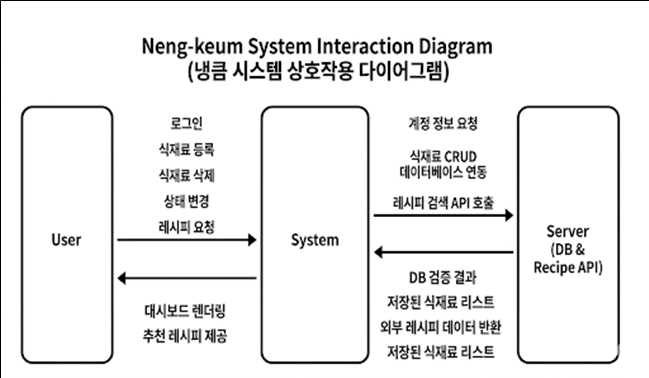

**1. Conceptualization**

**냉장고 관리 서비스 \<냉큼\>**

(22211499, 정형주, wjdgudwn36@gmail.com)

\[ Revision history \]

  ----------------- ----------- --------------------- -------------------
  **Revision date** **Version   **Description**       **Author**
                    \#**                              

                                                      

                                                      

                                                      

                                                      

                                                      

                                                      
  ----------------- ----------- --------------------- -------------------

= Contents =

1\.  Business purpose
    \...\...\...\...\...\...\...\...\...\...\...\...\...\...\...\...\...\...\...\...\...\...\...\...\...\...\....

2\. System context diagram
\...\...\...\...\...\...\...\...\...\...\...\...\...\...\...\...\...\...\...\...\...\...\.....

3\. Use case list
\...\...\...\...\...\...\...\...\...\...\...\...\...\...\...\...\...\...\...\...\...\...\...\...\...\...\...\...\.....

4\. Concept of operation
\...\...\...\...\...\...\...\...\...\...\...\...\...\...\...\...\...\...\...\...\...\...\...\...\....

5\. Problem statement
\...\...\...\...\...\...\...\...\...\...\...\...\...\...\...\...\...\...\...\...\...\...\...\...\...\.....

6\. Glossary
\...\...\...\...\...\...\...\...\...\...\...\...\...\...\...\...\...\...\...\...\...\...\...\...\...\...\...\...\...\...\...\....

7\. References
\...\...\...\...\...\...\...\...\...\...\...\...\...\...\...\...\...\...\...\...\...\...\...\...\...\...\...\...\...\...\...\....

 

**1. Business purpose**

--------------- -------------------------------------------------------

최근 1인 가구와 맞벌이 가구가 증가함에 따라 집에서 요리하는 횟수가
불규칙해지고 있습니다. 이로 인해 냉장고에 어떤 식재료가 있는지
잊어버리거나, 유통기한(소비기한)을 넘겨 음식을 폐기하는 문제가 빈번하게
발생합니다. 2024 식품소비행태조사_기초분석보고서에 따르면 '보관방법을
몰라 상한 식재료', '상하거나 오래된 음식'의 항목이 버려지는 쓰레기의
10%를 차지 하고 있습니다. 그러나 해당 문제를 줄이기 위해 택한 기존의
메모장이나 텍스트 위주의 관리로는 입력이 번거롭고 직관성이 떨어져
사용자들이 금방 사용을 포기하는 한계가 있었습니다.

\'냉큼\'은 직관적인 냉장고 형태의 UI를 제공하여 식재료 관리에 대한
사용자의 피로도를 낮추는 것을 목표로 합니다. 드래그 앤 드롭(Drag & Drop)
및 시각적 색상 변화를 통해 유통기한 임박 상태를 쉽게 파악하고, 보관방법
고지, 버려지기 쉬운 식재료를 활용한 맞춤형 레시피를 추천하여 음식물
쓰레기를 줄이는 환경 친화적이고 경제적인 웹 서비스를 구축하고자 합니다.

이를 통해 냉장고 안 식재료의 관리를 더욱 쉽게 하여 페기되거나 낭비되는
식재료를 줄임으로써 가구들의 식비를 절약하고, 음식물 쓰레기 배출의 양을
줄이며, 궁극적으로 사회 문제를 해결하는 하나의 방법이 될 수 있습니다.

--------------- -------------------------------------------------------

 

**2. System context diagram**

--------------- -------------------------------------------------------

--------------- -------------------------------------------------------

 

**3. Use case list**git 

1\) 로그인

  |  |  |
  | --- | --- |
  | Actor | User |
| Description | 고객과 매니저가 각자 자신의 아이디로 로그인한다. | 

  --------------- -------------------------------------------------------
 

2\) 식재료 등록

  |  |  |
  | --- | --- |
  | Actor | User |
| Description | 사용자가 등록할 식재료를 정리 | 

  --------------- -------------------------------------------------------
 

3\) 식재료 삭제

  |  |  |
  | --- | --- |
| Actor | User, System|
| Description | 요리에 사용했거나 폐기한 식재료를 시스템에서 삭제한다. | 

  --------------- -------------------------------------------------------
 

4\) 대시보드 조회

  |  |  |
  | --- | --- |
| Actor | User |
| Description | 냉장고 내의 식재료를 신선, 주의, 임박 상태(색상별)로 분류하여 한눈에 조회한다 | 

  --------------- -------------------------------------------------------
 

5\) 식재료 상태 변경

  |  |  |
  | --- | --- |
| Actor | User |
| Description | 식재료 아이콘을 \'요리 완료\' 또는 \'폐기\' 영역으로 이동시켜 상태를 업데이트 |

  --------------- -------------------------------------------------------
   

6\) 임박 식재료 레시피 추천

  |  |  |
  | --- | --- |
  | Actor | User | 
| Description | 유통기한이 가장 적게 남은 식재료를 기반으로 만들 수 있는 요리 레시피를 조회한다. |
  --------------- -------------------------------------------------------
 

**4. Concept of operation**

1\) Login

  |  |  |
  | --- | --- |
  | Purpose | 앱을 사용하기 위해 등록된 사용자인지 확인 |
  | Approach | 사용자가 웹 접속 후 로그인 시, ID, PW를 입력하여 서버에 전송하고 회원 정보를 조회하여 성공/실패 여부를 반환한다. |
  | Dynamics | 서비스 첫 진입 시 개인 냉장고 데이터를 불러오기 위해 실행 |
  | Goals | 개인화된 식재료 데이터를 보호하고 불러오기 위함 |

  --------------- -------------------------------------------------------

 

2\) 식재료 등록

  |  |  |
  | --- | --- |
  | Purpose | 냉장고에 보관 중인 식재료의 이름과 유통기한(소비기한)을 서버에 저장 |
  | Approach | 입력 폼을 통해 식재료 이름, 카테고리(냉장/냉동/실온), 날짜를 입력받는다. 프론트엔드에서 날짜 유효성을 검사한 후 백엔드 DB에 저장한다. |
  | Dynamics | 장보기를 마친 직후 사용자가 식재료를 정리할 때 실행 |
  | Goals | 사용자의 식재료 데이터를 DB에 축적하여 관리의 기반을 마련함 |

            
  --------------- -------------------------------------------------------

 

3\) 식재료 삭제

  |  |  |
  | --- | --- |
  | Purpose | 사용자가 식재료의 상태를 빠르고 직관적으로 파악 |
  | Approach | 사용자가 식재료 상세 정보 창에서 \'삭제\' 버튼을 누르거나, 대시보드 내 아이콘을 외곽 영역으로 이동시켜 삭제를 요청하거나, 유통기한이 지난 식재료를 자동으로 삭제시킨다. 시스템은 해당 데이터를 DB에서 제거한다. |
  | Dynamics | 사용자가 식재료를 요리에 모두 사용했음을 시스템에 반영하고 싶거나, 유통기한의 초과 데이터가 발견될 경우 |
  | Goals | 사용자 주도의 능동적인 데이터 정리 또는 사용자의 번거로운 수동 관리 없이도 최신 상태의 식재료 리스트가 유지되도록 지원한다. |

  --------------- -------------------------------------------------------

 

4\) 대시보드 조회

  |  |  |
  | --- | --- |
  | Purpose | 사용자가 식재료의 상태를 빠르고 직관적으로 파악 |
  | Approach | DB에서 불러온 식재료의 남은 유통기한을 프론트엔드에서 확인한다. 이를 컴포넌트화하여 화면에 렌더링한다. |
  | Dynamics | 사용자가 \'오늘 뭐 먹지?\' 고민하며 앱을 열었을 때 실행 |
  | Goals | 시각적 피드백을 통해 식재료 폐기를 사전에 방지함 |

  --------------- -------------------------------------------------------

 

5\) 식재료 상태 변경

  |  |  |
  | --- | --- |
  | Purpose | 식재료의 사용(요리) 및 폐기 처리를 간편하게 수행  |
  | Approach | 사용자가 DB에 관리되는 유통기한 데이터에 따라 프론트엔드 화면에서 식재료 아이콘을 특정 영역 상태를 변경한다. (예: 유통기한 지난 제품- 회색, 3일 이하-빨간색 깜빡임, 7일 이하-노란색, 그 외-초록색) |
  | Dynamics | 요리를 마쳤거나 상한 식재료를 버렸을 때 실행 |
  | Goals | 사용자 경험(UX)을 향상시켜 앱의 지속적인 사용을 유도함 |

  --------------- -------------------------------------------------------

 

6\) 임박 식재료 레시피 추천
  
  |  |  |
  | --- | --- |
  | Purpose | 처리하기 곤란한 식재료의 소비 촉진 |
  | Approach | 유통기한 임박 순서로 정렬된 최상단 식재료 1\~2개의 키워드를 추출하여, 외부 레시피 API(공공데이터 등)에 쿼리로 전송한 후 결과값을 리스트 형태로 화면에 출력한다. |
  | Dynamics | 유통기한이 얼마 남지 않은 식재료를 처리할 방법을 찾을 때 실행 |
  | Goals | 식재료 낭비를 줄이고 사용자에게 부가적인 가치를 제공함 |
        
  --------------- -------------------------------------------------------

 

**5. Problem statement**

--------------- -------------------------------------------------------

Overview: \'냉큼\'는 사용자가 식재료를 귀찮음 없이 관리하고 실시간
피드백을 받도록 하는 데 중점을 둡니다. 이를 위해 UI/UX 설계와
클라이언트-서버 간 데이터 처리에 있어 다음 문제들을 고려해야 합니다.

Problem #1: 식재료 입력의 번거로움 (Friction in Data Entry)

사용자가 매번 타자로 식재료와 날짜를 입력하는 것은 이탈률을 높이는 가장
큰 원인입니다. 초기 버전에서는 수동 입력에 자동완성 기능을 제공하고,
추후 영수증 텍스트 인식(OCR)이나 바코드 API 연동을 통해 입력 과정을
최소화할 수 있도록 프론트엔드 입력 폼 확장이 필요합니다.

Problem #2: 데이터 최신화 및 렌더링 (Data Refresh & Rendering)

유통기한은 시간에 따라 계속 변하므로, 사용자가 접속할 때마다 화면에
즉각적으로 임박 상태(색상 변화 등)가 계산되어야 합니다. React의 상태
관리(State Management)를 활용하여 서버 요청을 최소화하면서도 화면의
데이터를 부드럽게 갱신(Refresh)해야 합니다.

Problem #3: 기기 호환성 (Cross-Browser Compatibility)

주방에서 요리를 하거나 마트에서 장을 볼 때 스마트폰 웹 브라우저로 주로
접속할 것이므로, 모바일 환경에 최적화된 화면 설계가 필수적입니다.

----------------------------------- -----------------------------------

 

**6. Glossary**

  ----------------------------------- -----------------------------------

 
  
  | Terms | Description |
  | --- | --- |
  | 대시보드 (Dashboard) | 식재료 아이콘들이 냉장고 칸의 형태로 한눈에 보이게 배치된 메인 화면 UI. |
  | 유통기한 임박 | 유통기한 또는 소비기한이 현재 날짜 기준으로 3일 이내로 남은 상태. |
  | Drag & Drop | 화면상의 그래픽 요소(식재료 아이콘)를 마우스나 터치로 끌어서 다른 영역으로 옮기는 프론트엔드 상호작용 기술. |
  | REST API | 클라이언트(웹)와 서버(Spring Boot) 간에 데이터를 효율적으로 주고받기 위한 통신 규칙.
  | UI/UX (사용자 인터페이스/사용자 | UI는 사용자가 접하는 화면의 시각적 경험) 디자인(냉장고 형태 등)이며, UX는 앱을 사용하며 느끼는 편리함, 직관성 등의 총체적 경험. \'냉큼\'은 직관적 UI를 통해 UX 향상을 목표로 함. |
  | 데이터베이스 (DB, Database) | 회원 정보 및 냉장고 내 식재료의 이름, 카테고리, 날짜 등 영구적으로 보관해야 할 데이터를 구조화하여 저장하는 시스템. |
  | 렌더링 (Rendering) | DB에서 불러온 식재료 데이터를 기반으로 유통기한 남은 날짜 등을 계산하여 사용자의 화면(대시보드 등)에 시각적인 형태(아이콘, 색상 등)로 출력하는 과정. |
  | 상태 관리 (State Management) | 사용자의 상호작용(입력, Drag & Drop 등)에 따라 화면에 표시되는 데이터(상태)를 효율적으로 관리하고 갱신하는 기술. 웹 브라우저에서 서버 요청을 최소화하며 부드러운 화면 전환을 위해 사용됨 (React의 기능 활용). |
  | CRUD (Create, Read, Update, Delete) | 대부분의 소프트웨어가 가지는 기본적인 데이터 처리 기능인 생성(등록), 조회, 수정(상태 변경), 삭제를 통칭하는 말. |
  ----------------------------------- -----------------------------------

 

**7. References**

----------------------------------- -----------------------------------

식품의약품안전처 - 소비기한 표시제도 안내

React 공식 문서 (상태 관리 및 Drag and Drop 라이브러리 가이드)

공공데이터포털 - 조리법(레시피) 관련 Open API (적용 검토)

한국농촌경제연구원 -- 2024 식품소비행태조사 기초분석보고서

----------------------------------- -----------------------------------
