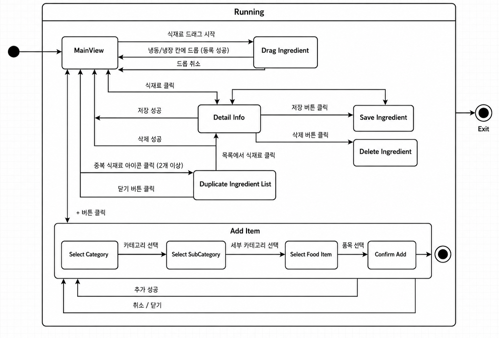
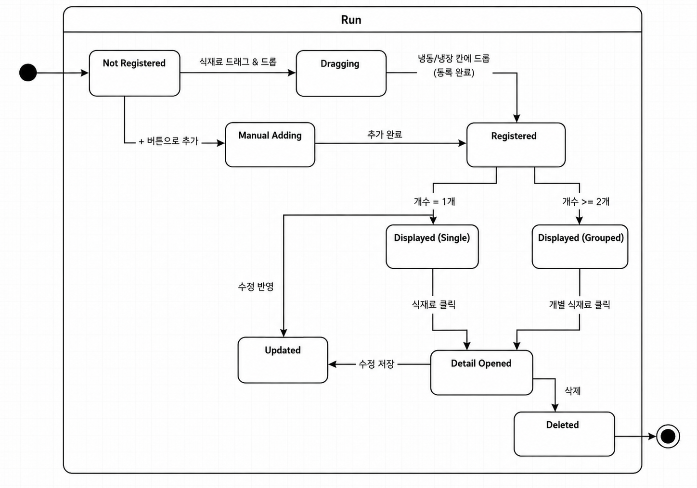

# Design

<!-- 이 문서의 내용을 요약하고, 내 디자인의 중요한 요소를 서술  -->

## 1. Introduction

본 문서는 냉장고 식재료 관리 서비스인 ‘냉큼(Neng-Kuem)’의 Design 단계 문서이다. Conceptualization 단계에서 정의한 서비스의 목적과 핵심 아이디어, Analysis 단계에서 도출한 유스케이스와 도메인 모델을 바탕으로 시스템의 구체적인 구조와 동작 방식을 설계하는 것을 목적으로 한다.

‘냉큼’은 사용자가 냉장고에 보관 중인 식재료를 직관적으로 관리할 수 있도록 냉장고 형태의 대시보드 UI를 제공한다. 사용자는 왼쪽 식재료 목록에서 원하는 식재료를 드래그 앤 드롭하여 냉장고 칸에 등록할 수 있으며, 등록된 식재료를 클릭하여 이름, 메모, 유통기한 등의 상세 정보를 확인하고 수정할 수 있다. 또한 같은 식재료가 여러 개 존재하는 경우에는 중복 식재료를 하나의 그룹으로 묶어 보여줌으로써 화면의 복잡도를 줄이고, 개별 식재료의 상태를 구분하여 관리할 수 있도록 한다.

본 Design 문서에서는 이러한 기능을 실제 시스템 구조로 구체화하기 위해 클래스 다이어그램, 시퀀스 다이어그램, 상태 머신 다이어그램을 제시한다. 클래스 다이어그램에서는 AppContent, FoodItem, DroppedItem, Ingredient, Storage, User, IngredientHistory, Recipe 등 주요 구성 요소의 역할과 속성을 정의한다. 시퀀스 다이어그램에서는 식재료 등록, 삭제, 대시보드 조회, 상태 변경, 로그인, 레시피 추천과 같은 주요 기능이 사용자 인터페이스, 컨트롤러, 서비스, 데이터 저장 구조 사이에서 어떤 순서로 처리되는지를 나타낸다. 또한 수동 정보 입력, 검색 및 필터링, 자동 만료 처리, 전체 보기 및 다중 삭제, 중복 식재료 그룹 조회와 같은 세부 기능의 흐름도 함께 설계한다.

상태 머신 다이어그램에서는 사용자가 서비스 화면을 이용하면서 경험하는 화면 상태 변화와, 개별 식재료 객체가 등록 전 상태에서 등록, 표시, 수정, 삭제 상태로 변화하는 생명주기를 표현한다. 이를 통해 ‘냉큼’ 서비스가 단순한 식재료 목록 관리가 아니라, 사용자의 조작 흐름과 식재료 데이터의 상태 변화를 함께 고려한 구조로 설계되었음을 보여준다.

따라서 본 문서는 ‘냉큼’ 서비스의 기능을 구현하기 위한 설계 기준을 제시하며, 직관적인 냉장고형 UI, 드래그 앤 드롭 기반 등록, 유통기한 상태 표시, 중복 식재료 관리, 수동 입력, 레시피 추천 기능을 중심으로 시스템의 전체 구조와 동작 흐름을 설명한다.

 
<!-- 클래스 다이어그램을 그리고, 속성, 메소드 같은 세부적인 것을 클래스 다이어 그램에 묘사 -->

## 2. Class Diagram

### 2.1 <냉큼의 Class Diagram>

 

  

 

---

### 2.2 클래스 별 설명

 

  

 

 

| AppContent |  |
| :--- | :--- |
| **Description** | '냉큼' 서비스의 메인 대시보드 화면을 렌더링하고 사용자의 상호작용을 처리하는 최상위 리액트 컴포넌트입니다. 드래그 앤 드롭 이벤트를 감지하여 UI의 상태(State)를 즉각적으로 업데이트하며, 백엔드 API와의 통신을 주도하여 클라이언트와 서버 간의 데이터 동기화를 책임집니다. |
| **Attribute** |  |
| freezerItems | 사용자가 냉동 칸에 배치한 식재료 객체들의 목록을 담고 있는 상태 배열입니다. |
| fridgeItems | 사용자가 냉장 칸에 배치한 식재료 객체들의 목록을 담고 있는 상태 배열입니다. |
| isDraggingFromFridge | 사용자가 냉장고 내부의 식재료를 집어 외부(휴지통 영역 등)로 이동시키고 있는지를 판별하는 논리값입니다. |
| selectedItem | 상세 정보 창을 띄우기 위해 사용자가 클릭하여 활성화된 특정 식재료 객체입니다. |
| **Operation** |  |
| handleDrop() | 드래그한 식재료를 특정 칸에 놓았을 때 고유 ID를 부여하고 배열에 추가합니다. |
| handleUpdateItem() | 상세 모달창에서 수정된 이름이나 유통기한을 기존 배열 데이터에 덮어씌웁니다. |
| handleDeleteItem() | 상세 창에서 삭제 버튼 클릭 시 단일 식재료를 배열에서 제거합니다. |
| handleDeleteItems() | 다중 선택 모드에서 여러 식재료를 일괄적으로 삭제 처리합니다. |
| handleTrashDrop() | 식재료를 냉장고 바깥 영역에 놓았을 때 해당 ID의 객체를 찾아 삭제합니다. |

 

  

 

| DroppedItem |  |
| :--- | :--- |
| **Description** | 기본 식재료 규격(FoodItem)을 상속받아, 사용자가 실제 냉장고 화면에 배치한 개별 식재료의 정보를 정의하는 프론트엔드 전용 인터페이스입니다. 백엔드와 통신할 때 사용하는 데이터 전송 객체(DTO)의 형태를 결정하며, 고유 식별자와 위치 정보를 추가로 포함합니다. |
| **Attribute** |  |
| uniqueId | 화면 렌더링 및 개별 식재료 추적을 위해 프론트엔드에서 생성되는 고유 식별자입니다. |
| section | 해당 식재료가 배치된 보관 영역(예: 냉장실, 냉동실)을 구분하는 문자열입니다. |
| customName | 사용자가 기본 식재료 이름 대신 자신만의 명칭으로 수정한 이름입니다. |
| memo | 해당 식재료에 대해 사용자가 덧붙인 메모 사항입니다. |
| registeredDate |식재료가 냉장고에 처음 등록된 시점의 타임스탬프입니다. |
| expiryDate | 사용자가 지정한 유통기한 만료 날짜입니다. |
| **Operation** |  |
| (데이터 규격 정의용 인터페이스이므로 자체 비즈니스 오퍼레이션을 가지지 않습니다.) |  |

 

  

 

| FoodItem |  |
| :--- | :--- |
| **Description** | 시스템에서 제공하는 기본 식재료 마스터 데이터의 규격을 정의하는 인터페이스입니다. 사용자가 드래그 앤 드롭을 시작하기 전, 좌측 사이드바에 나열되는 공통 식재료 목록들의 형태를 규정합니다. |
| **Attribute** |  |
| id | 기본 식재료를 식별하기 위한 분류 ID(예: 'onion')입니다. |
| name | 기본 식재료의 명칭(예: '양파')입니다. |
| emoji | 화면에 직관적으로 표시하기 위한 이모지 아이콘 값입니다. |
| category | 육류, 채소류 등 대분류 카테고리 명칭입니다. |
| subCategory | 대분류 하위의 소분류 카테고리 명칭입니다. |
| **Operation** |  |
| (데이터 규격 정의용 인터페이스이므로 자체 비즈니스 오퍼레이션을 가지지 않습니다.) |  |

 

  

 

| IngredientController |  |
| :--- | :--- |
| **Description** | 프론트엔드 클라이언트로부터 들어오는 식재료 관련 REST API 요청을 가장 먼저 수신하는 프레젠테이션 계층의 컨트롤러입니다. 요청 데이터를 검증하고 적절한 비즈니스 로직(Service)으로 라우팅한 뒤, 처리 결과를 HTTP 상태 코드와 함께 반환합니다. |
| **Attribute** |  |
| (스프링 빈 의존성 주입 외의 상태를 가지지 않는 싱글톤 객체이므로 별도의 도메인 속성이 없습니다.) |  |
| **Operation** |  |
| getDashboardItems() | 특정 사용자의 냉장고 전체 식재료 데이터를 조회하여 반환합니다. |
| saveDroppedItem() | 새로운 식재료 등록 요청을 받아 서비스에 저장을 위임합니다. |
| updateDroppedItem() | 기존 식재료의 정보(이름, 유통기한 등) 수정 요청을 처리합니다. |
| deleteDroppedItem() | 특정 식재료의 영구 삭제 및 소비 처리를 위한 요청을 수행합니다. |

 

  

 

| IngredientService |  |
| :--- | :--- |
| **Description** | 애플리케이션의 핵심 비즈니스 규칙과 트랜잭션을 관리하는 서비스 클래스입니다. 식재료 등록 및 삭제 시 단순히 DB에 값을 넣고 빼는 것을 넘어, 상태 이력(History)을 누적 기록하고 유통기한 만료를 체크하는 등의 복잡한 로직을 총괄합니다. |
| **Attribute** |  |
| (데이터베이스 접근을 위한 Repository 계층 객체들을 의존성으로 가집니다.) |  |
| **Operation** |  |
| processIngredientRegistration | 전달받은 DTO를 엔티티로 변환하여 저장하고 최초 등록 히스토리를 생성합니다. |
| updateIngredientDetails | 식재료의 변경 사항을 DB에 반영하고 상태 값을 재계산합니다. |
| removeIngredient | 대상 식재료를 DB에서 지우거나 상태를 변경하고, 폐기/소비에 대한 히스토리를 남깁니다. |
| checkDailyExpirationScheduler | 매일 자정마다 전체 식재료의 유통기한을 검사하여 상태를 업데이트하는 스케줄러 로직입니다. |

 

  

 

| User |  |
| :--- | :--- |
| **Description** | '냉큼' 서비스에 가입하여 냉장고 보관소를 소유하는 주체인 회원 엔티티입니다. 인증 및 인가 과정을 거쳐 로그인에 성공한 사용자의 기본 프로필 정보를 저장하며, 시스템 내 모든 식재료 데이터 접근의 권한 기준이 됩니다. |
| **Attribute** |  |
| id | 사용자를 식별하는 데이터베이스의 고유 기본키(PK)입니다. |
| email | 사용자의 로그인 아이디로 사용되는 이메일 주소입니다. |
| nickname | 서비스 내에서 표시되는 사용자의 닉네임입니다. |
| **Operation** |  |
| (데이터를 담는 엔티티 클래스이므로 기본적인 Getter/Setter 외의 복잡한 로직은 가지지 않습니다.) |  |

 

  

 

| Storage |  |
| :--- | :--- |
| **Description** | 사용자가 소유한 냉장고의 물리적인 보관 칸을 추상화한 데이터베이스 엔티티입니다. 하나의 사용자는 여러 개의 보관 칸(예: 냉장실, 냉동실, 신선칸)을 가질 수 있으며, 각 식재료가 어느 칸에 속해 있는지 관계형 구조로 관리합니다. |
| **Attribute** |  |
| id | 보관소 레코드를 식별하는 고유 기본키(PK)입니다. |
| name | 해당 보관 칸의 이름(예: '내 방 냉동실')을 나타냅니다. |
| type | 보관소의 냉각 방식을 나타내는 열거형 값입니다. |
| **Operation** |  |
|  |  |

 

  

 

| Ingredient |  |
| :--- | :--- |
| **Description** | 실제 데이터베이스에 영속적으로 저장되는 개별 식재료의 원본 데이터를 담은 핵심 엔티티입니다. 프론트엔드의 화면 조작 결과를 최종적으로 반영하여 식재료의 신선도 상태와 유통기한 정보를 안전하게 유지하고 관리합니다. |
| **Attribute** |  |
| Id | 식재료 레코드를 식별하는 데이터베이스 고유 기본키(PK)입니다. |
| serverUniqueId | 프론트엔드에서 생성한 uniqueId와 시스템 DB를 매핑하기 위한 식별값입니다. |
| name | 실제 보관 중인 식재료의 명칭입니다. |
| status | 현재 식재료의 신선도 상태(안전, 임박, 만료 등)입니다. |
| expirationDate | 계산의 기준이 되는 식재료의 유통기한 일자입니다. |
| storage |  |
| **Operation** |  |
|  |  |

 

  

 

| IngredientHistory |  |
| :--- | :--- |
| **Description** | 사용자가 식재료를 등록하고 조작하며 최종적으로 소비(또는 폐기)하기까지의 모든 생명주기 내역을 로깅(Logging)하는 엔티티입니다. 데이터의 투명성을 보장하고 추후 사용자의 식습관 패턴이나 소비율을 분석하는 기초 데이터로 활용됩니다. |
| **Attribute** |  |
| id | 이력 레코드를 식별하는 고유 기본키(PK)입니다. |
| actionType | 사용자가 수행한 행위의 종류(생성, 변경, 폐기 등)를 구분합니다. |
| logTimestamp | 해당 조작 행위가 발생한 서버 기준의 시간입니다. |
| ingredientName | 식재료가 삭제되더라도 기록을 유지하기 위해 별도로 저장하는 식재료의 이름입니다. |
| **Operation** |  |
|  |  |

 

  

 

| Recipe |  |
| :--- | :--- |
| **Description** | 유통기한이 임박한 식재료를 빠르게 소진할 수 있도록 사용자에게 제공되는 요리 방법 데이터를 담은 엔티티입니다. 식재료 명칭을 키워드로 삼아 매칭되는 레시피를 검색하고 추천하는 기능의 기반이 됩니다. |
| **Attribute** |  |
| id | 레시피 레코드를 식별하는 고유 기본키(PK)입니다. |
| title | 사용자에게 보여질 레시피의 제목입니다. |
| ingredientsRequired | 해당 레시피를 만들기 위해 필요한 필수 식재료 키워드 목록입니다. |
| **Operation** |  |
| (데이터를 담는 엔티티 클래스이므로 기본적인 Getter/Setter 외의 복잡한 로직은 가지지 않습니다.) |  |

 

<!-- 내 1. 시스템의 전체적인 기능에 대한 시퀀스 다이어그램을 그리기, 2. 컨셉단계에서 만들었던 유스케이스를 연관지어서 만들기, 3. 각각의 시퀀스 다이어그램 설명 -->

## 3. Sequence Diagram

### 1) 식재료 등록 (Ingredient Registration)

  

식재료 등록 Use case에서의 Sequence Diagram이다. 사용자가 장보기를 마친 후 식재료를 애플리케이션의 냉장고 칸으로 드래그 앤 드롭하여 등록하는 핵심 기능을 담당한다. 프론트엔드인 AppContent와 백엔드의 IngredientController, IngredientService 클래스가 주축이 되어 작동한다.
먼저 사용자가 식재료 아이콘을 드롭하면 AppContent는 임시 uniqueId를 부여하고 서버에 식재료 등록(POST)을 비동기로 요청한다. IngredientController는 요청을 받아 IngredientService로 식재료 등록 비즈니스 로직 처리를 위임하며, Service는 Database에 새로운 식재료 데이터 엔티티와 등록 이력(History)을 저장한다. 저장이 성공적으로 완료되면 Controller를 거쳐 AppContent로 200 OK 응답이 전달되고, 최종적으로 프론트엔드 UI 상태가 갱신되며 등록 절차가 마무리된다.

 

### 2) 식재료 삭제 및 휴지통 버리기 (Ingredient Delete)

  

식재료 삭제 Use case에서의 Sequence Diagram이다. 사용자가 식재료를 요리에 소비하거나 폐기하기 위해 휴지통 영역으로 드래그할 때 발생하는 데이터 삭제 및 이력 저장 흐름을 보여준다.
사용자의 휴지통 드롭 또는 삭제 버튼 클릭 액션이 발생하면 AppContent는 내부적으로 handleTrashDrop 메소드를 실행한 후, IngredientController로 서버 식재료 삭제(DELETE)를 요청한다. Controller의 호출을 받은 IngredientService는 식재료 삭제 로직을 처리하며, Database에서 대상 데이터를 삭제함과 동시에 소비/폐기 이력(History)을 기록한다. 백엔드 처리가 완료되어 반환 성공 응답이 전달되면, AppContent는 내부 배열에서 해당 객체를 제거하고 화면을 갱신하여 사용자에게 즉각적으로 변경된 상태를 제공한다.

 

### 3) 메인 대시보드 조회 (Dashboard Inquiry)

  

메인 대시보드 조회 Use case에서의 Sequence Diagram이다. 사용자가 애플리케이션에 처음 접속했을 때, 저장된 식재료 목록을 불러오고 유통기한 임박 정도를 시각적으로 보여주는 기능을 수행한다.
AppContent 화면이 렌더링될 때 IngredientController에 대시보드 서버 데이터 조회를 요청(GET)하면, IngredientService는 대시보드 조회 로직을 통해 Database에서 해당 사용자의 전체 식재료 데이터를 조회한다. 이후 반환된 식재료 Entity 리스트를 프론트엔드에서 사용하기 적합한 DTO 리스트로 변환하여 반환한다. 응답을 받은 AppContent는 내부적으로 유통기한 색상 계산 메소드(getExpiryStatus)를 실행하여 각 식재료의 상태를 계산하고, 이를 바탕으로 유통기한별 색상이 적용된 냉장고 화면을 사용자에게 표시한다.

 

### 4) 식재료 상태 변경 (Ingredient Status Update)

  

식재료 상태 변경 Use case에서의 Sequence Diagram이다. 사용자가 식재료의 보관 위치(예: 냉장실에서 냉동실)를 이동시키거나 상세 모달창에서 정보를 수정할 때 발생하는 데이터 업데이트 흐름이다.
사용자가 조작을 마치면 AppContent에서 식재료 데이터 서버 등록(PUT)을 요청하며, IngredientController를 거쳐 IngredientService가 상태 로직 처리를 시작한다. Database 내의 Storage 위치 또는 유통기한 등의 데이터가 최종적으로 Update 되며, 업데이트 완료 결과가 Controller를 통해 프론트엔드로 반환된다. 마지막으로 AppContent는 반환 성공 결과를 바탕으로 변경된 정보로 UI를 갱신하여 시스템과 화면의 데이터 동기화를 완료한다.

 

### 5) 임박 식재료 레시피 추천 (Recipe Recommendation)

  

 

레시피 추천 Use case에서의 Sequence Diagram이다. 유통기한이 얼마 남지 않은 식재료를 효과적으로 소비할 수 있도록 외부 오픈 API와 연동하여 맞춤형 요리법을 제공하는 복합적인 기능을 담당한다. RecipeController와 RecipeService가 핵심 역할을 수행한다.
사용자가 레시피 추천 버튼을 클릭하면 RecipeService가 실행되어 Database에서 유통기한이 가장 임박한 식재료를 우선 조회한다. 식재료 키워드를 반환받은 Service는 이를 바탕으로 외부 OpenAPI(공공데이터 API 등)에 HTTP GET 요청을 보내 레시피 검색 결과를 받아온다. 받아온 외부 JSON 데이터는 시스템에 맞는 Recipe DTO로 파싱되어 AppContent로 전달되며, 최종적으로 레시피 모달창이 렌더링되어 사용자에게 추천 레시피 화면을 제공한다.

 

### 6) 로그인 (Login)

  

 

시스템 로그인 Use case에서의 Sequence Diagram이다. 서비스 진입 시 사용자를 인증하고, 인가된 사용자에게만 개인화된 냉장고 데이터를 제공하기 위한 필수 보안 및 진입 절차이다.
사용자가 ID와 PW를 입력하여 로그인을 시도하면, AppContent는 AuthController로 로그인 API 요청을 전송한다. AuthService는 전달받은 자격 증명을 바탕으로 Database의 회원정보를 조회하여 일치 여부를 확인(authenticate)한다. 성공적으로 User 데이터가 검증되면 인증 결과(토큰 등)가 포함된 로그인 성공 응답이 프론트엔드로 반환되고, AppContent는 대시보드 화면으로의 라우팅을 수행하여 본격적인 서비스 이용 흐름으로 연결한다.

 

### 7) 수동 정보 입력 (Manual Entry)

  

 

수동 정보 입력 Use case에서의 Sequence Diagram이다. 사용자가 식재료를 드래그 앤 드롭하는 방식이 아니라, 품목 추가 버튼을 통해 식재료의 이름, 메모, 유통기한 등의 세부 정보를 직접 입력하여 등록하는 절차를 나타낸다. 사용자가 AppContent 화면에서 품목 추가 버튼을 클릭하면 AppContent는 수동 입력 모달창을 표시하고, 사용자는 등록할 식재료의 이름, 메모, 유통기한 정보를 입력한다. 입력이 완료되면 AppContent는 입력값을 검증한 뒤 IngredientController로 수동 등록 요청을 전송한다. IngredientController는 전달받은 데이터를 IngredientService로 넘기고, IngredientService는 해당 정보를 기반으로 Ingredient 엔티티를 생성하여 저장한다. 또한 최초 등록 행위를 IngredientHistory에 함께 기록하여 이후 식재료의 생명주기 추적이 가능하도록 한다. 저장이 정상적으로 완료되면 처리 결과가 IngredientController를 거쳐 AppContent로 반환되며, AppContent는 새로 등록된 식재료가 냉장고 화면에 나타나도록 UI 목록을 갱신한다.

 

### 8) 검색 및 필터링 (Search & Filter)

  

 

검색 및 필터링 Use case에서의 Sequence Diagram이다. 사용자가 냉장고 안에 등록된 식재료 중 특정 식재료를 빠르게 찾거나, 유통기한 상태와 보관 위치 등의 조건에 따라 식재료 목록을 좁혀 보는 절차를 나타낸다. 사용자가 AppContent 화면에서 검색어를 입력하거나 필터 조건을 선택하면 AppContent는 먼저 현재 화면에 보유한 식재료 목록을 기준으로 1차 필터링을 수행한다. 이후 서버 재조회가 필요한 경우 IngredientController로 조건 기반 조회 요청을 전송하고, IngredientController는 IngredientService에 검색 조건을 전달한다. IngredientService는 사용자의 Ingredient 목록에서 검색어 또는 필터 조건에 맞는 식재료를 조회한 뒤, 조회 결과를 DTO 형태로 변환하여 AppContent로 반환한다. AppContent는 반환된 결과를 바탕으로 조건에 맞는 식재료만 화면에 렌더링하며, 일치하는 항목이 없는 경우에는 검색 결과가 없음을 사용자에게 안내한다.

 

### 9) 자동 만료 처리 (Expiration Scheduler)

  

 

자동 만료 처리 Use case에서의 Sequence Diagram이다. 사용자가 직접 조작하지 않아도 시스템이 주기적으로 식재료의 유통기한을 검사하여 만료 상태를 반영하고, 필요한 경우 이력을 남기는 백그라운드 처리 절차를 나타낸다. IngredientService의 checkDailyExpirationScheduler가 정해진 시간에 실행되면, 시스템은 전체 Ingredient 목록을 조회한다. 이후 각 Ingredient의 expirationDate를 현재 날짜와 비교하여 유통기한이 지났는지, 임박 상태인지, 아직 안전한 상태인지를 판단한다. 유통기한이 지난 식재료는 EXPIRED 상태로 변경되거나 Soft Delete 처리될 수 있으며, 상태 변경이 발생한 경우 IngredientHistory에 시스템 만료 처리 이력을 기록한다. 모든 식재료에 대한 검사가 끝나면 IngredientService는 변경된 상태와 이력 저장 결과를 정리하고 배치 처리를 종료한다. 이 기능은 사용자가 매번 직접 확인하지 않아도 냉장고 데이터가 최신 상태로 유지되도록 돕는 역할을 한다.

 

### 10) 전체 보기 및 다중 삭제 (View All & Multiple Delete)

  

 

전체 보기 및 다중 삭제 Use case에서의 Sequence Diagram이다. 사용자가 냉장고 칸에 들어 있는 식재료를 한 번에 확인하고, 여러 식재료를 선택하여 일괄 삭제하는 절차를 나타낸다. 사용자가 AppContent 화면에서 더보기 버튼을 클릭하면 전체 식재료 목록이 표시되고, 사용자는 삭제 모드로 진입하여 삭제할 식재료 항목들을 다중 선택한다. 삭제 요청이 발생하면 AppContent는 선택된 식재료들의 식별 정보를 IngredientController로 전달한다. IngredientController는 일괄 삭제 요청을 IngredientService에 위임하고, IngredientService는 선택된 Ingredient들을 대상으로 삭제 또는 상태 변경 처리를 수행한다. 동시에 삭제된 식재료들에 대한 소비 또는 폐기 이력이 IngredientHistory에 기록된다. 모든 삭제 처리가 완료되면 처리 결과가 AppContent로 반환되며, AppContent는 삭제된 항목들을 목록에서 제거하고 전체 보기 화면과 냉장고 UI를 최신 상태로 갱신한다.

 

### 11) 중복 식재료 그룹 조회 (Duplicate Ingredient Group)

  

중복 식재료 그룹 조회 Use case에서의 Sequence Diagram이다. 동일한 식재료가 여러 개 등록되어 있을 때, 사용자가 대표 아이콘을 클릭하여 해당 식재료들의 개별 목록을 확인하는 절차를 나타낸다. AppContent는 대시보드 렌더링 과정에서 같은 이름 또는 같은 식재료 ID를 가진 Ingredient들을 하나의 그룹으로 묶어 대표 아이콘과 개수 배지로 표시한다. 사용자가 중복 표시된 식재료 아이콘을 클릭하면 AppContent는 해당 그룹의 상세 목록 조회를 IngredientController로 요청한다. IngredientController는 IngredientService에 그룹 조회 처리를 위임하고, IngredientService는 동일한 이름이나 분류 정보를 가진 Ingredient 목록을 조회한다. 조회된 중복 식재료 목록은 DTO 리스트 형태로 AppContent에 반환되며, AppContent는 각 식재료의 유통기한, 메모, 보관 위치 등을 확인할 수 있는 리스트 UI 또는 모달창을 표시한다. 이 기능을 통해 사용자는 같은 식재료가 여러 개 있을 때도 각각의 등록일과 유통기한을 구분하여 관리할 수 있다.

 

<!-- 1. 고객과 서버 시스템에 대한 스테이트 머신 다이어그램 그리기, 2. 각각의 스테이트 머신 다이어그램을 설명 -->

## 4. State Machine Diagram

### 1) AppContent 화면 상태 머신

  

 

AppContent 화면 상태 머신 다이어그램은 사용자가 냉큼 서비스를 이용하면서 메인 냉장고 화면에서 겪게 되는 전체적인 화면 흐름을 나타낸다. 현재 구현된 냉큼 서비스는 별도의 로그인 화면 없이 앱 실행과 동시에 MainView 상태로 진입한다. MainView는 사용자가 냉동 칸, 냉장 칸, 왼쪽 식재료 목록을 확인할 수 있는 기본 화면 상태이다.

사용자가 왼쪽 식재료 목록에서 식재료를 드래그하면 Drag Ingredient 상태로 전이된다. 이 상태는 사용자가 식재료를 잡고 이동 중인 상태를 의미한다. 이후 식재료를 냉동 칸 또는 냉장 칸에 정상적으로 드롭하면 등록이 완료되고 다시 MainView 상태로 돌아간다. 만약 드래그 도중 취소되거나 적절한 위치에 드롭하지 않은 경우에도 MainView 상태로 복귀한다.

MainView에서 이미 등록된 식재료 아이콘을 클릭하면 Detail Info 상태로 진입한다. Detail Info 상태에서는 식재료의 이름, 메모, 유통기한 등의 상세 정보를 확인하고 수정할 수 있다. 사용자가 저장 버튼을 클릭하면 Save Ingredient 상태로 이동하여 식재료 정보가 수정되고, 저장이 성공적으로 완료되면 다시 MainView 상태로 돌아간다. 반대로 삭제 버튼을 클릭하면 Delete Ingredient 상태로 진입하며, 식재료 삭제 처리가 완료되면 MainView로 복귀한다.

또한 같은 식재료가 2개 이상 등록되어 있는 경우, MainView에서는 하나의 대표 아이콘과 개수 표시로 중복 식재료를 보여준다. 사용자가 해당 중복 식재료 아이콘을 클릭하면 Duplicate Ingredient List 상태로 이동하여 같은 식재료들의 목록을 확인할 수 있다. 이 목록에서 특정 식재료를 클릭하면 다시 Detail Info 상태로 이동하여 개별 식재료의 상세 정보를 확인하거나 수정할 수 있다. 목록 창을 닫으면 MainView 상태로 돌아간다.

마지막으로 MainView에서 냉동 칸 또는 냉장 칸의 + 버튼을 클릭하면 Add Item 상태로 진입한다. Add Item 상태는 품목을 직접 추가하기 위한 복합 상태로, 내부적으로 Category Select, SubCategory Select, Food Item Select, Confirm Add 상태를 순서대로 거친다. 사용자가 먼저 대분류 카테고리를 선택하면 Select Category 상태에서 Select SubCategory 상태로 이동하고, 세부 카테고리를 선택하면 Select Food Item 상태로 이동한다. 이후 등록할 식재료 품목을 선택하고 Confirm Add 상태에서 추가를 확정하면 식재료 데이터가 생성된다. 추가가 성공적으로 완료되면 다시 MainView 상태로 돌아가며, 사용자가 추가 도중 취소하거나 닫기 버튼을 누른 경우에도 MainView로 복귀한다. 이처럼 AppContent 화면 상태 머신은 사용자가 냉장고 화면에서 식재료를 등록, 조회, 수정, 삭제, 추가하는 전체 UI 흐름을 표현한다.

 

### 2) 식재료 객체 상태 머신

  

 

식재료 객체 상태 머신 다이어그램은 냉큼 서비스 안에서 하나의 식재료 객체가 생성되기 전부터 삭제되기까지 거치는 상태 변화를 나타낸다. 식재료는 처음에 Not Registered 상태에서 시작한다. 이 상태는 아직 냉장고에 등록되지 않은 식재료를 의미하며, 사용자가 왼쪽 식재료 목록에서 드래그하거나 + 버튼을 통해 직접 추가하기 전의 상태이다.

사용자가 식재료를 드래그 앤 드롭 방식으로 등록하려는 경우, 식재료 객체는 Not Registered 상태에서 Dragging 상태로 전이된다. Dragging 상태는 사용자가 식재료를 잡고 냉장고 칸으로 이동 중인 상태이다. 이후 식재료가 냉동 칸 또는 냉장 칸에 정상적으로 드롭되면 Registered 상태로 이동한다. Registered 상태는 식재료가 냉장고 안에 정상적으로 등록된 상태를 의미한다.

반대로 사용자가 + 버튼을 눌러 식재료를 직접 추가하는 경우에는 Not Registered 상태에서 Manual Adding 상태로 전이된다. Manual Adding 상태에서는 사용자가 카테고리, 세부 카테고리, 식재료 품목, 이름, 메모, 유통기한 등의 정보를 입력한다. 입력과 추가가 완료되면 해당 식재료 객체는 Registered 상태로 이동한다. 따라서 Registered 상태는 드래그 앤 드롭 등록과 수동 추가 등록이 모두 합쳐지는 공통 등록 완료 상태라고 볼 수 있다.

Registered 상태가 된 식재료는 동일한 식재료의 개수에 따라 표시 방식이 달라진다. 같은 식재료가 1개뿐이라면 Displayed Single 상태로 전이되어 단일 식재료 아이콘으로 화면에 표시된다. 반면 같은 식재료가 2개 이상 존재한다면 Displayed Grouped 상태로 전이되어 중복 식재료 그룹 형태로 표시된다. Displayed Grouped 상태에서는 사용자가 대표 아이콘을 클릭하여 중복된 식재료 목록을 확인할 수 있고, 그중 하나의 식재료를 선택할 수 있다.

사용자가 단일 식재료를 클릭하거나, 중복 식재료 목록에서 개별 식재료를 클릭하면 Detail Opened 상태로 이동한다. Detail Opened 상태는 해당 식재료의 상세 정보 창이 열린 상태로, 사용자는 식재료의 이름, 메모, 유통기한을 확인하거나 수정할 수 있다. 사용자가 수정 내용을 저장하면 Updated 상태로 전이된다. Updated 상태는 식재료 정보가 변경된 상태이며, 수정 결과가 반영되면 다시 등록된 식재료 흐름으로 돌아가 화면에 갱신된 정보가 표시된다.

만약 Detail Opened 상태에서 사용자가 삭제를 선택하면 Deleted 상태로 이동한다. Deleted 상태는 식재료 객체가 냉장고 목록에서 제거된 상태를 의미하며, 이 상태에 도달하면 해당 식재료 객체의 생명주기는 종료된다. 즉, 식재료 객체 상태 머신은 식재료가 등록되지 않은 상태에서 시작하여 등록, 표시, 상세 조회, 수정 또는 삭제로 이어지는 전체 생명주기를 표현한다.

 

<!-- 내 시스템을 실행하기 위한 작동 환경 설명 -->

## 5. Implementation Requirements

 

| 구분 | 실행 요구사항 |
| :--- | :--- |
| 사용 기기 | 데스크톱, 노트북, 태블릿 등 웹 브라우저 실행이 가능한 기기 |
| 운영체저 | Windows, macOS, Linux, iPadOS, Android 등 최신 웹 브라우저를 지원하는 운영체제 |
| 웹 브라우저 | Chrome, Edge, Safari, Firefox 등 HTML5와 JavaScript를 지원하는 최신 브라우저 |
| 화면 환경 | 냉장고 대시보드와 식재료 목록을 원활히 확인할 수 있는 화면 크기 권장 |
| 네트워크 | 로그인, 식재료 데이터 조회, 저장, 수정, 삭제, 레시피 추천 요청을 처리할 수 있는 인터넷 연결 |
| 입력 방식 | 마우스 또는 터치 입력을 통한 클릭, 드래그 앤 드롭 조작 |

 

<!-- 이 문서에 사용된 모든 용어들의 구체적인 묘사 -->

## 6. Glossary

| 용어 | 설명 |
| :--- | :--- |
| DTO | Data Transfer Object의 약자로, 화면과 서버 사이에서 데이터를 주고받기 위해 사용하는 객체 형식이다. |
| Entity | 시스템에서 관리해야 하는 핵심 데이터를 표현하는 객체이다. 데이터베이스에 저장되는 주요 정보 단위를 의미한다. |
| Modal | 현재 화면 위에 겹쳐 표시되는 팝업 형태의 창이다. 식재료 상세 정보, 품목 추가, 중복 식재료 목록 등을 보여줄 때 사용된다. |
| Soft Delete | 데이터를 실제로 완전히 삭제하지 않고, 삭제된 상태로 표시하여 일반 조회에서 보이지 않도록 처리하는 방식이다. |
<!-- 인용한 모든 자료 설명 -->

 

## 7. References

 

| 자료명 | 설명 | URL |
| :--- | :--- | :--- |
 OMG UML Specification | Class Diagram, Sequence Diagram, State Machine Diagram의 UML 표기법과 설계 기준을 참고하기 위해 사용한 공식 명세 자료이다. | https://www.omg.org/spec/UML/2.5.1/About-UML |
 | React Hooks Documentation | 식재료 목록, 선택된 식재료, 모달 표시 여부 등 화면 상태를 관리하는 구조를 설계할 때 참고한 공식 문서이다. | https://react.dev/reference/react/hooks |
 | React DnD useDrop Documentation | 냉장고 칸을 드롭 대상 영역으로 설정하고, 드롭된 식재료를 처리하는 흐름을 설계할 때 참고한 문서이다. | https://react-dnd.github.io/react-dnd/docs/api/use-drop/ |